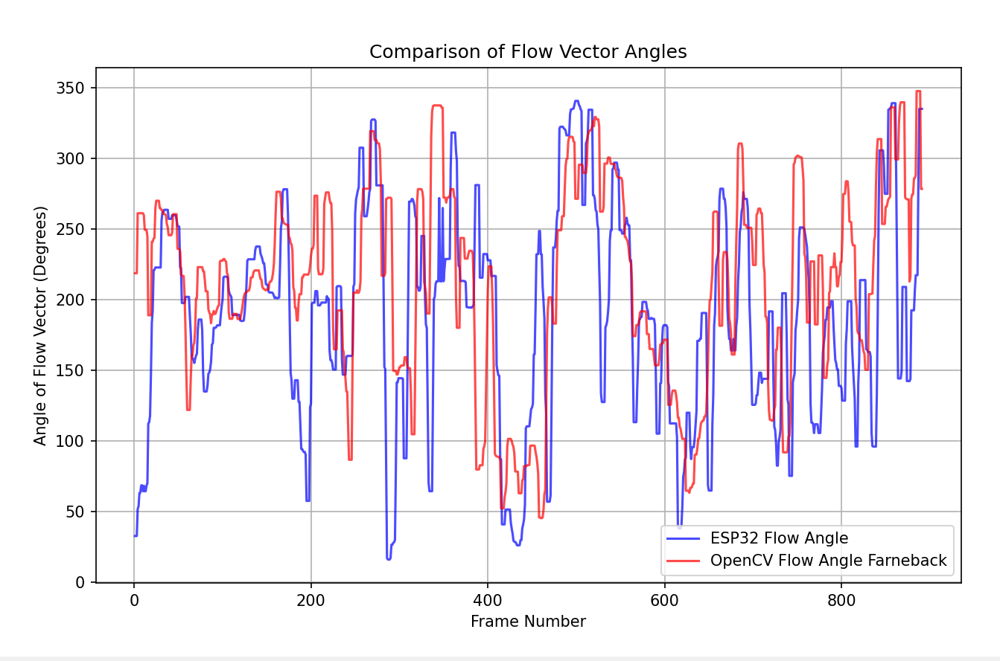
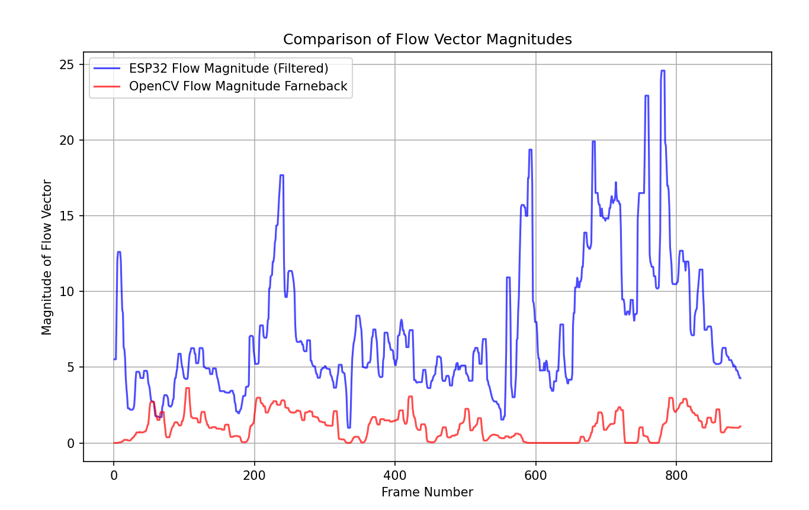
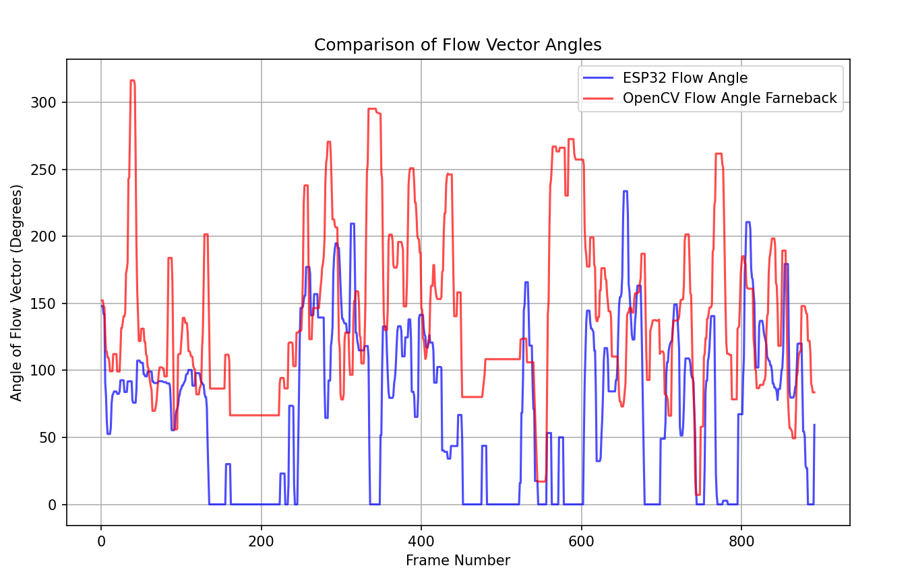
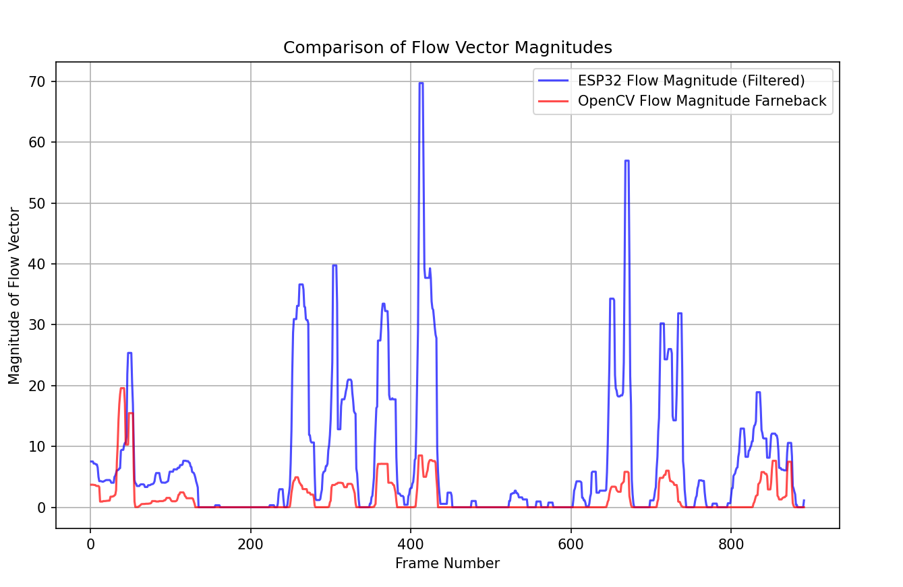
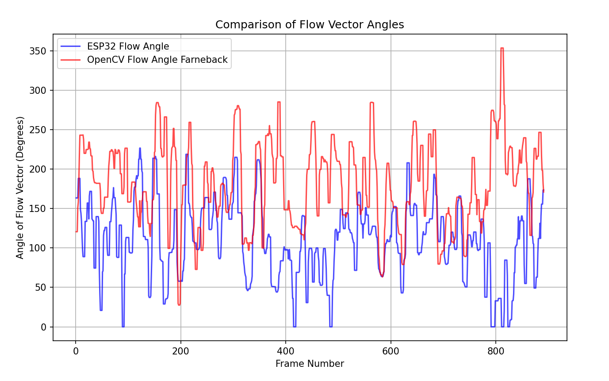
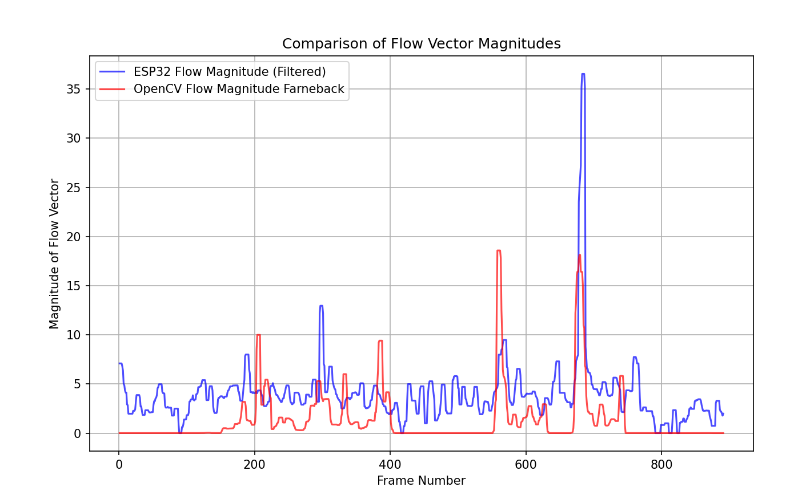

# Optical Flow Graphs
This section presents the results of optical flow processing using OpenCV and the ESP32. As shown in the analysis of the POV video, the angle calculations for the flow vectors closely match those generated by OpenCV. In contrast, for the traffic camera videos, the ESP32 successfully detects motion at the same frames as OpenCV, which is evident from the timing of the magnitude spikes in the optical flow vectors.

### Video 1 
[Source](https://www.youtube.com/watch?v=b-WViLMs_4c&t=2s)

#### Angle

#### Magnitude

### Video 2
[Source](https://www.youtube.com/watch?v=MNn9qKG2UFI)

#### Angle

#### Magnitude

### Video 3

#### Angle

#### Magnitude

